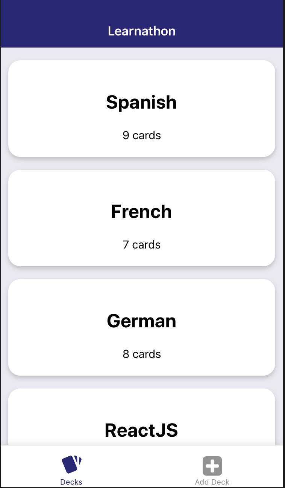
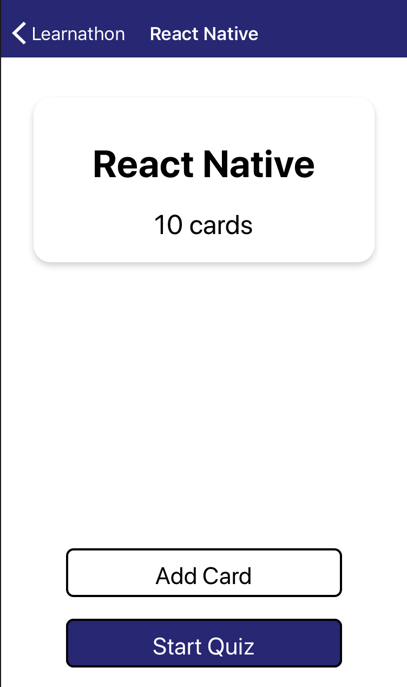
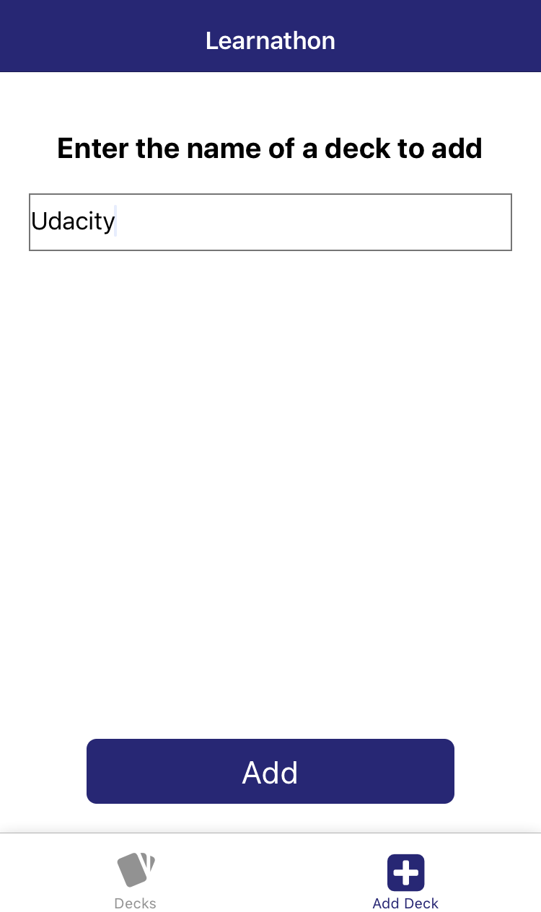
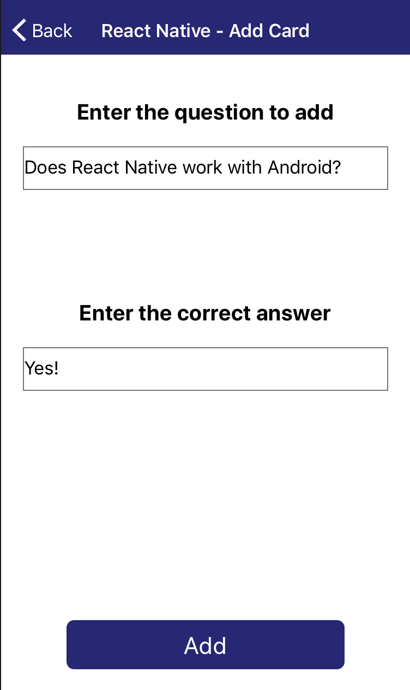
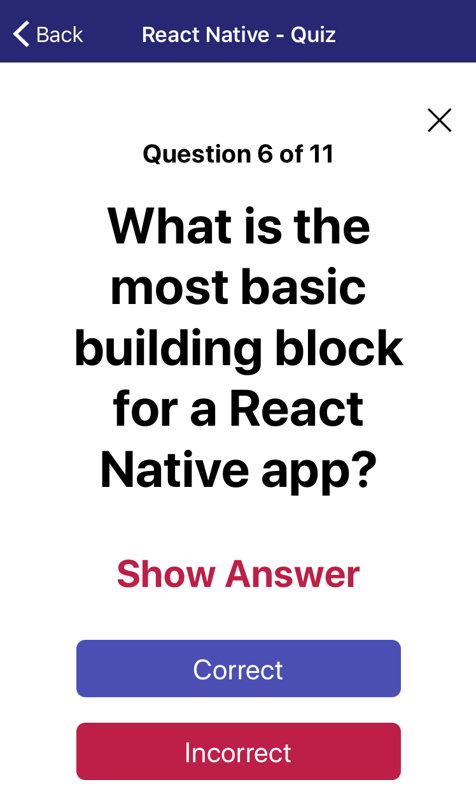
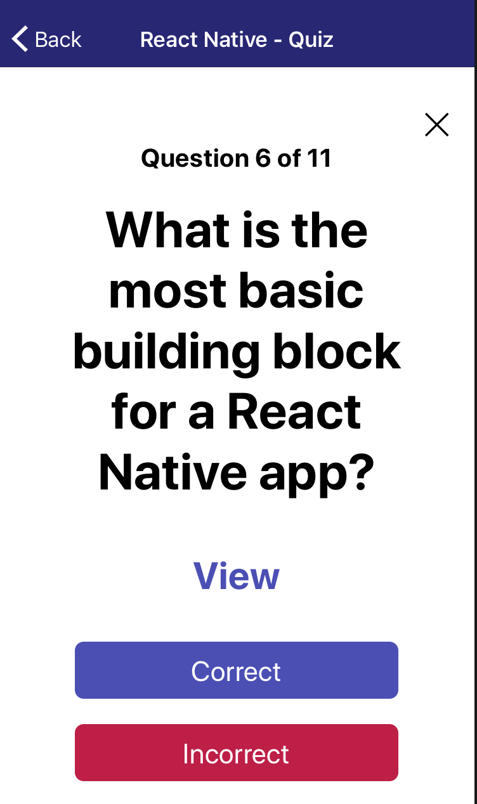
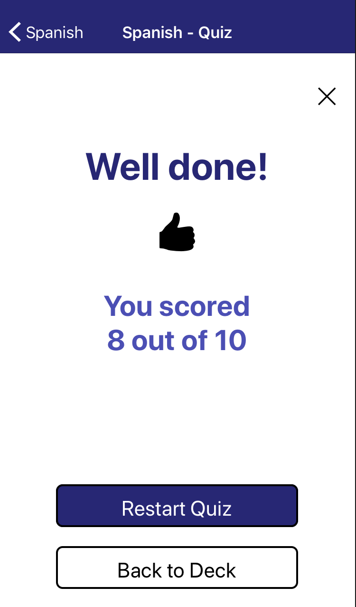
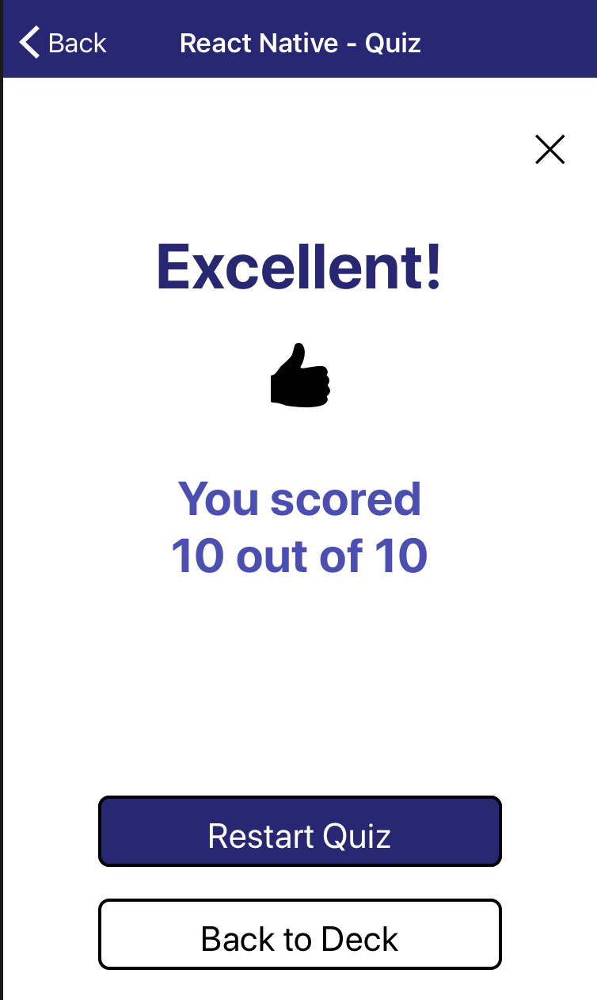

# Learnathon

This mobile app created with React Native is your perfect mobile companion for learning on the go. Learning a new language? Have a test tomorrow? Need a quick reference guide for your topic? With Learnathon, you can create flashcards that you can use to test your knowledge whenever, wherever. Start by entering your topic, and any number of questions/answers, and you will be able to start a quiz right away. To keep your knowledge fresh, the app will remind you to take at least one quiz every day. Keep on learning!

## How to run

This app works on both Android and iOS devices and simulators.
You will need to have installed [npm](https://www.npmjs.com/) in your machine.
1. Clone this repository and navigate to the root folder of the app
2. Run 'npm install' to download all the packages needed
3. Run 'npm start' to start up the application. 

#### To run the app on an Android or iOS device:
You will need to have Expo installed ([Android Play Store](https://play.google.com/store/apps/details?id=host.exp.exponent) or [iOS App Store](https://itunes.com/apps/exponent)). Once installed, you can scan the QR code in the terminal to download the app. 
#### To run the app on an iOS simulator:
You will have to have [Xcode](https://developer.apple.com/xcode/downloads/) installed. Once you have a simulator installed, type 'i' in the terminal to load the app in the simulator. 
#### To run the app on an Android simulator:
You will have to have [Genymotion](https://www.genymotion.com/fun-zone/) installed. Follow the installation guide [here](https://docs.genymotion.com/Content/01_Get_Started/Installation.htm). Once you've installed Genymotion, create a simulator (e.g. Nexus 6) and type 'a' in the terminal to load the app in the simulator.

For more information on Expo and loading this app in a device or simulator, click [here](https://docs.expo.io/versions/latest/introduction/installation.html).

## List of Decks

The landing page contains a list of your decks with the card count of each:

## Deck Details

You can get more details on a specific deck by tapping on it from the list of decks:

## Add Deck

You can add a new deck by clicking on the 'Add Deck' tab:

## Add Card

You can also add a card to an existing deck from the Deck Details view:

## Quiz

You can start a quiz on an existing deck from the Deck Details view. You will be presented with the flashcards for that topic, and initially the answer will be hidden behind 'Show Answer':

Once you are ready to see the answer, you can tap on 'Show Answer', which will reveal the correct answer to the question. You can then mark yourself as 'Correct' or 'Incorrect' to move on to the next question:

## Results

Once you have gone through all the questions in a deck, you will be given the final score, which includes a tailored message that reflects your performance. Here are a few examples:

